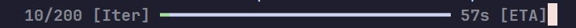

  <h1 style="background: linear-gradient(to right, black, white); -webkit-background-clip: text; -webkit-text-fill-color: transparent; margin: 0;">
        CROP CIRCLES
    </h1>
    

        
    

     
     
    

        
         
        
        
         
    

## 🚀 Features
- **PyTorch based**: The library is based on pure PyTorch with utilities, layers and data manipulation.
- **Researches**: All deep models are inspired by articles on tabular data from arxiv.org
- **Tabular problems**: The library is attempting to solve tabular data problems applying deep approaches surpassing regular GBDTs (Gradient Boosted Desicion Trees).
- **Data manipulation**: The library includes a set of utilities to manipulate data, including data augmentation, data preparation and so on.
- **Model selection**: The library includes a set of models that can be used to solve various problems.
- **Easy-to-use**: The library is attempting to unify deep learning decisions for building a single scikit-like API.
- **Parallel universe!**: Currently the main module (RiegelRing) can be run in parallel using Horovod.

## :blue_book: Contents
* *deeplayers*: Small collection of deep layers that can be implemented in models
* *deeplib*: Collection of helper modules for data preparation, augmentation, metrics eval and on.
* *models*: Models available to use, adapted from / inspired by arxiv.org (links included). Navigate to models/README.md to access guidelines 
* *utils*: Data preparation tools (without digging deep)
* *parallel.sh*: Single script to run Horovod (may cause problems)

## 🌟 Available Models
I am proud to present a collection of cutting-edge models designed to tackle various tabular data challenges. Each model is inspired by the latest research and optimized for performance. Here’s a quick overview of the models included in the library:
- **SAINT**: A powerful model that combines the strengths of attention mechanisms (`SelfAttn` and `IntersampleAttn`) to effectively capture complex relationships in tabular data between numerical and categorical variables. Ideal for tasks requiring nuanced understanding of feature interactions.
- **DANet**: This model leverages its own `AbstractLayer` to enhance feature representation, making it particularly effective for datasets with intricate patterns. DANet excels in scenarios where context and relationships between features are crucial.
- **SuperForest**: A hybrid model that integrates the robustness of ensemble methods with deep learning techniques. SuperForest is designed to outperform traditional models by intelligently combining predictions from multiple sources.
- **RiegelRing**: Inspired by transformer architectures, RiegelRing is tailored for tabular data, enabling it to learn from patterns and dependencies. This model is perfect for tasks that benefit from a transformer’s ability to handle complex interactions. RiegelRing is a `Top Frontier` deep tabular model according to arxiv.org
- **TANDEM**: The **Temporal Aberrated Neural Differentiable Embedding Mechanism** (TANDEM) is designed to capture temporal dynamics in tabular data. By incorporating weight and gradient noise, TANDEM enhances robustness and generalization. This model is particularly effective for tasks that require understanding of temporal relationships and variations in data, making it a valuable addition to your deep learning toolkit.

Explore these models and discover how they can elevate your deep learning projects!  
  
## 📚 Research Papers
Dive deeper into the innovative architectures behind integrated models by exploring the original research papers. Each model is backed by cutting-edge research, and these links will take you directly to the ArXiv papers for further reading:
- **SAINT**: [Read the SAINT Paper](https://arxiv.org/pdf/2106.01342)  
  Discover how SAINT leverages attention mechanisms to enhance tabular data processing.
- **DANet**: [Read the DANet Paper](https://arxiv.org/pdf/2112.02962)  
  Learn about the abstract mechanisms that make DANet a powerful tool for feature representation.
- **RiegelRing**: [Read the original ExcelFormer Paper](https://arxiv.org/pdf/2301.02819)  
  Understand how RiegelRing adapts transformer architectures for tabular data.
- **SuperForest**: `SuperForest is developed by the author, Reisen Raumberg, 2024.`  
  Explore the hybrid approach that combines ensemble methods with deep learning techniques. Please, refer to the code base.
- **TANDEM**: [Read the TANDEM Paper](https://arxiv.org/pdf/2106.11189), `mostly developed by the author, Reisen Raumberg, 2024`  
Delve into the mechanisms that allow TANDEM to effectively model temporal dynamics in tabular datasets.

These papers provide valuable insights into the methodologies and experiments that shaped the development of these models. Happy reading!

## 🎉 New Feature: TensorFlow-like Progress Bar
I am excited to announce the recent implementation of a TensorFlow-like progress bar in the library! This feature enhances the user experience by providing a visually appealing and informative way to track the progress of your computations.

    

> The new progress bar is designed to be intuitive and easy to use, making it a perfect addition to your deep learning workflows.  

> [!IMPORTANT]
> Please, feel free to contribute to the lib. Let's develop some useful models and tools together! My contacts are in my profile